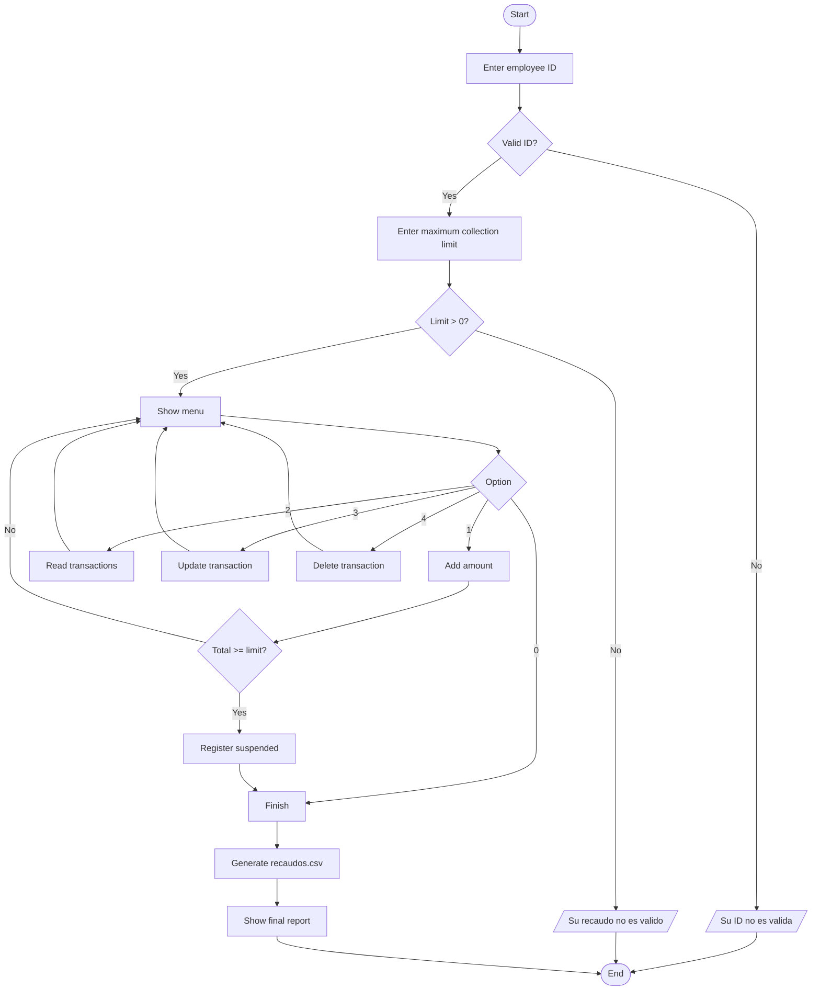

# Cashier Collection Control System

A **Python** console application that simulates collection control for a cash register. It validates the cashier's identity, assigns a **maximum collection limit**, and lets the cashier manage transactions through a CRUD menu (add, read, update, and delete). If the accumulated collection reaches the limit, the register is **automatically suspended for security reasons**. When the session ends, the transactions are exported to a CSV file and a final report is displayed.

> **Note:** The program's on-screen messages and prompts are in Spanish. This README explains them in English and shows the exact messages the program prints.

---

## Table of Contents

- [Features](#features)
- [Requirements](#requirements)
- [Installation and Usage](#installation-and-usage)
- [Program Flow](#program-flow)
- [Usage Guide](#usage-guide)
- [Example Session](#example-session)
- [Generated CSV File](#generated-csv-file)
- [Implemented Validations](#implemented-validations)
- [Code Structure](#code-structure)
- [Known Limitations](#known-limitations)
- [Future Improvements](#future-improvements)
- [Author](#author)

---

## Features

- **Authentication** of the cashier through an authorized employee ID.
- **Configurable collection limit** for each session.
- **Full CRUD menu** for transactions:
  - Add an amount
  - Read (list) transactions
  - Update an existing transaction
  - Delete a transaction
- **Automatic register suspension** when the accumulated collection reaches or exceeds the limit.
- **Always-consistent running total**: it is recalculated whenever a transaction is added, updated, or deleted.
- **CSV export** (`recaudos.csv`) containing the cashier ID and each amount.
- **Final report** with the total collected, number of transactions, and average amount.
- Handling of invalid input when entering amounts (`try/except`).

---

## Requirements

- **Python 3.6 or higher**
- No external libraries required: it only uses the `csv` module from the standard library.

To check your Python version:

```bash
python --version
```

---

## Installation and Usage

1. **Clone the repository**

   ```bash
   git clone https://github.com/YOUR-USERNAME/REPOSITORY-NAME.git
   cd REPOSITORY-NAME
   ```

2. **Run the program** (replace `main.py` with the actual name of your file)

   ```bash
   python main.py
   ```

3. **Enter a valid employee ID** when prompted.

### Authorized Employee IDs

The program includes three test IDs defined in the `trabajadores` list:

| # | Employee ID |
|---|-------------|
| 1 | `01250371062` |
| 2 | `01250371059` |
| 3 | `01250371084` |

> If the entered ID is not in the list, the program prints `Su ID no es valida` ("Your ID is not valid") and exits.

---

## Program Flow



---

## Usage Guide

Once the ID and the limit have been validated, the following menu is displayed:

```
=====================================
1). Agregar
2). Leer
3). Actualizar
4). Borrar
0). Finalizar
=====================================
```

These correspond to Add, Read, Update, Delete, and Finish.

### 1. Add (Agregar)

Registers a new transaction.

- Prompts for the amount (a whole number greater than zero).
- Typing `FIN` (uppercase or lowercase) or `0` **ends the session** and goes straight to the final report.
- After adding, the running total is displayed.
- If the total **reaches or exceeds the limit**, the register is suspended and the session ends:

```
=====================================
CAJA SUSPENDIDA: se alcanzo el tope de recaudo.
Dirijase a tesoreria.
=====================================
```

### 2. Read (Leer)

Shows all recorded transactions with their position number. If there are none, it prints `No hay transacciones` ("There are no transactions").

### 3. Update (Actualizar)

Shows the list, then asks for the number of the transaction to modify and the new amount. The running total is adjusted by subtracting the old amount and adding the new one.

### 4. Delete (Borrar)

Shows the list, then asks for the number of the transaction to remove and subtracts its value from the running total.

### 0. Finish (Finalizar)

Exits the menu loop, generates the CSV file, and displays the final report.

---

## Example Session

```text
Por favor, Ingrese su ID de empleado: 01250371062
Su ID ha sido validada
Ingrese el tope maximo de recaudo: 100000
Su recaudo ha sido validado, prosiga
=====================================
1). Agregar
2). Leer
3). Actualizar
4). Borrar
0). Finalizar
=====================================
Ingrese su opcion: 1
Ingrese el monto o FIN para terminar: 25000
Transaccion agregada correctamente
Recaudo acumulado: 25000
...
Ingrese su opcion: 2
1 . 25000
2 . 40000
...
Ingrese su opcion: 0

=====================================
           REPORTE FINAL
=====================================
Cajero: 01250371062
Tope asignado: 100000
Transacciones procesadas: 2
Recaudo total: 65000
Monto promedio: 32500.0
=====================================
```

---

## Generated CSV File

When the session ends (via option `0`, via `FIN`, or because the register was suspended), a file named **`recaudos.csv`** is created in the same folder as the program. Each row contains the cashier ID and the amount of one transaction, **with no header row**:

```csv
01250371062,25000
01250371062,40000
```

> **Note:** The file is opened in write mode (`"w"`), so it is **overwritten on every run**.

---

## Implemented Validations

| Validation | Behavior |
|------------|----------|
| Unregistered employee ID | Prints `Su ID no es valida` and exits |
| Collection limit <= 0 | Prints `Su recaudo no es valido` and exits |
| Non-numeric amount when adding | Prints `Monto no valido` (the program does not crash) |
| Amount <= 0 when adding or updating | Prints `El monto debe ser mayor que cero` |
| Position out of range when updating/deleting | Prints `Transaccion no encontrada` |
| Reading, updating, or deleting with no transactions | Prints `No hay transacciones` |
| Nonexistent menu option | Prints `Opcion no valida` |
| Total >= limit | Suspends the register and ends the session |

---

## Code Structure

| Element | Description |
|---------|-------------|
| `acumulable` | Counter for the accumulated collection total |
| `pedidos` | List holding the amount of each transaction |
| `trabajadores` | List of authorized employee IDs |
| `ID` | ID entered by the cashier |
| `recaudo` | Maximum collection limit for the session |
| `opcion` | Option chosen in the menu |

Program sections (marked with comments in the code):

1. **Counter and lists**: variable initialization.
2. **ID and limit validation**.
3. **Customer service**: `while True` loop with the menu.
4. **CRUD**: add, read, update, and delete.
5. **Security suspension**.
6. **CSV creation**.
7. **Final report**.

Suggested repository structure:

```
repository-name
├── main.py
├── recaudos.csv      # generated when the program runs
└── README.md
```

---

## Known Limitations

- If text is entered where a number is expected in the **collection limit**, the **menu option**, the **position**, or the **new amount** when updating, the program raises a `ValueError` and stops (only the amount when adding is protected with `try/except`).
- When **updating** a transaction, the limit is not checked again: the total could exceed it without triggering the suspension.
- Employee IDs are **hardcoded** in the source.
- Data is only preserved in the CSV file, which is **overwritten** on every run.
- The CSV has no headers and no date/time for each transaction.

---

## Future Improvements

- Validate all numeric inputs with `try/except`.
- Check the limit when updating transactions as well.
- Save the CSV in append mode, or with a unique name per session (date/time).
- Add headers and a timestamp to the CSV.
- Load authorized IDs from a file or database.
- Split the code into functions to improve readability and make testing easier.
- Add unit tests.

---

## Author

**Your name**
GitHub: [@YOUR-USERNAME](https://github.com/YOUR-USERNAME)

---

## License

This project is distributed under the **MIT** license. See the `LICENSE` file for more information (or change this section to match the license you choose).
